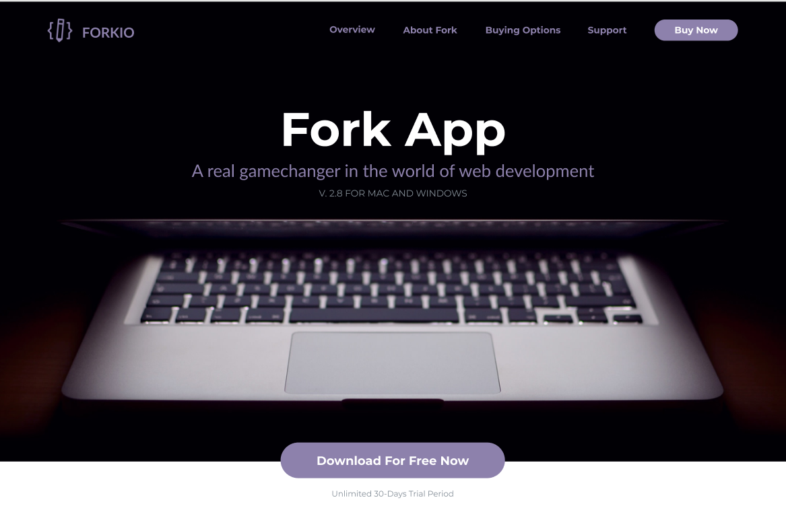

# При розробці проекту використовувались такі технології:
* HTML з використанням симантичних тегів;
* Методолгія найменування класів BEM;
* Mobile first;
* Adaptive and responsive design:
    * _Flexbox;_
    * _Grid;_
* Css припроцесор SASS SCSS;
    * _Media qery;_
    * _Змінні;_
    * _Mixin_
* NPM та його модулі;
* Проект був зібраний за допомогою Gulp;
___

# Склад розробників проекту:
* ___Клецький Богдан___
* ___Ляшенко Максим___
___

# Список виконаних робіт:
* _Клецький Богдан_: 
    * Зверстав секцію Revolutionary Editor;
    * Зверстав секцію Here is what you get;
    * Зверстав секцію Fork Subscription Pricing;
* _Ляшенко Максим_:
    * Зверстав меню сайту;
    * Зверстав секцію People Are Talking About Fork;
___

___
# Для запуску прокту використати команди:
    1. npm i
    2. gulp build
    3. gulp dev 
